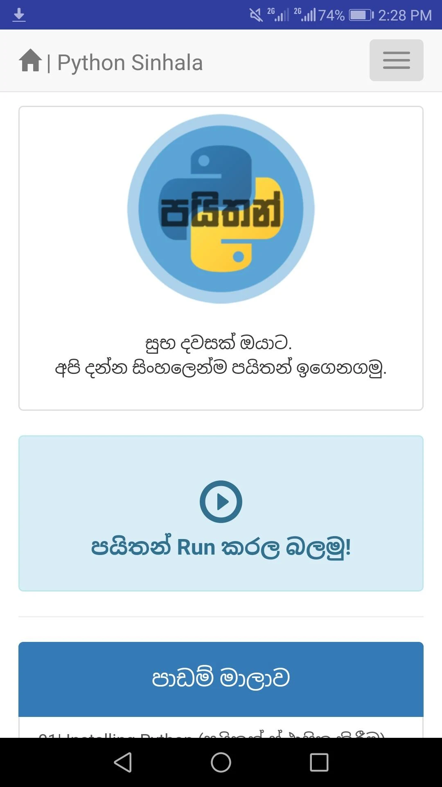

# 🏆 Accomplishments

## Newspaper Articles
 

 

    

## [Python Leaning App](https://play.google.com/store/apps/details?id=bevylabs.buddhika.pythonsinhala) 🔗

- Responsibilities:
> - An android application that helps people to startup with programming. It has over 5000 downloads through the Google Playstore.
 

    
    

## The Concentration Device 
- A concentration device that based on psychology techniques (Color psychology, Pomodoro technique)

> - <b>Awards</b> 3rd Place (Bronze Medal) in Applied Science & Technology, "Sahasak Nimeum" National Exhibition and Competition 2018 An Exhibition Organized by Sri Lanka Inventors Commission.
> - <b> Merit Award </b>  National Best Quality ICT Awards (NBQSA) 2018 Organized by British Computer Society (BCS) - The Chartered Institute for IT.
Finalist IEEE SS12 MakerFair South Asian Exhibition and Competition 2018 An innovations exhibition Organized by IEEE
> - <b> What I learnt</b> Believing the ideas, psychology techniques, prototyping, improving the version of an hardware project, 3D printing, working with interrupts in micro controllers.
 

    
    
    

## Bevy Labs Fly Bee
- An autonomous drone that can fly using detecting lines.
 
 

    
    

## TeaCollect++ 
-  New concept for tea collecting process in Sri lanka.This system provides various solutions for problems in manual tea collecting process.

> - <b>Awards</b>  Finalist in SLTIOT(Sri lanka Telecome) Challenge 2017 / Finalist in iHack 2.0
20
 
 

    
    
    

## Robot SilverTips
-  This robot is designed for grab objects with color detection, line maze solving and going though the limited spaces.

> - <b>Awards</b> 5th place of Xboticx 2016 A task based Robotics Competition organized by Faculty of Engineering, University of Ruhuna.
 
 

    
 
    

## As a resource person for workshops

-  We conducted several workshops on preparing for robotics competitions and hosted some motivational sessions to inspire the students to achieve their goals. Additionally, we received a lot of positive feedback on our workshops

 

    
  
   
    
    

