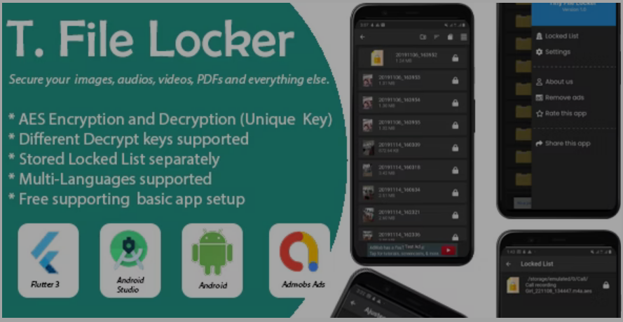
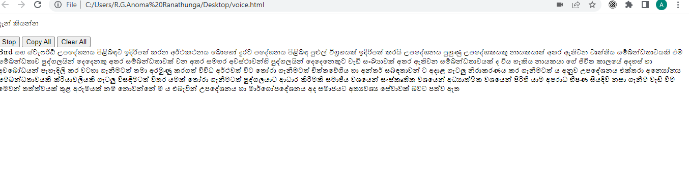
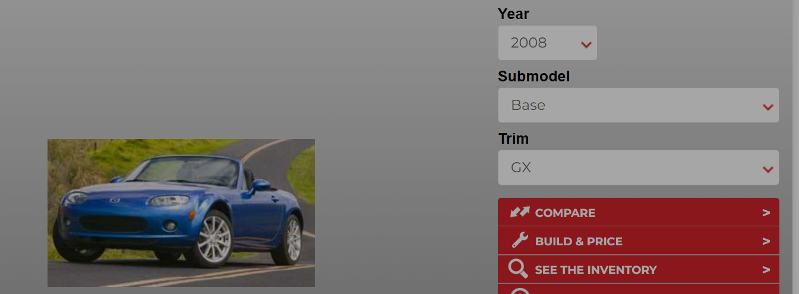
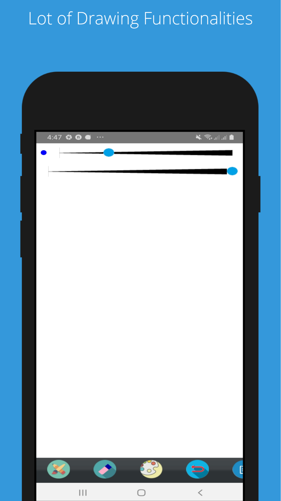
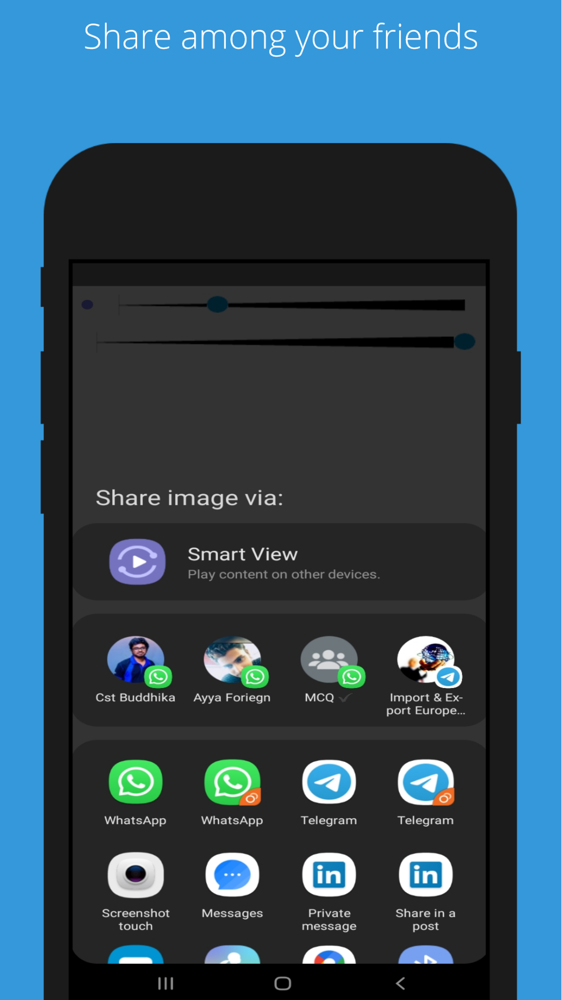
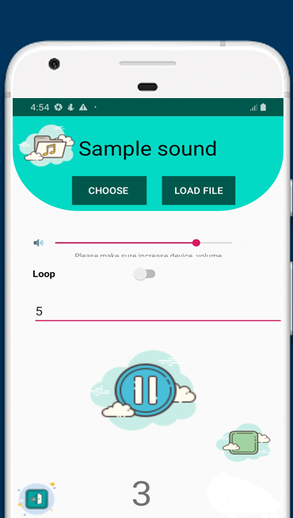
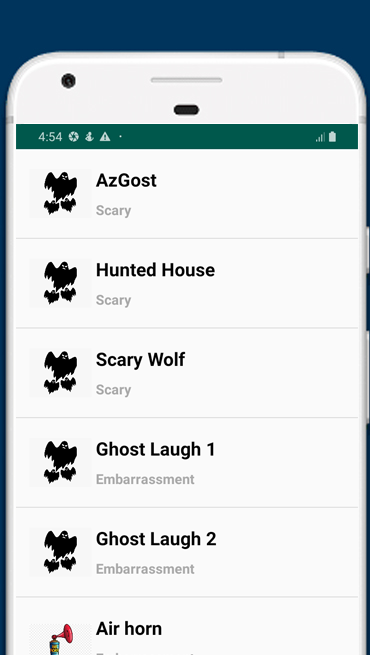

# 🐶 Pet Projects
#### [These are the projects that I have built in my spare time.]
 
## [Video Scheduling App](https://github.com/praneethpj/Flutter_Video_Consultant_App_FrontEnd) 🔗
> - Research UI and UX.
> - Research existing application techniques and technologies.
> - Develop User interfaces and functions including user authentication, appointment scheduling, and video calls, professionals' availability, with call reminders for both users and professionals,professional profile search and the ability to transition a user profile into a professional profile. 
> - Develop Backend APIs have been developed using Node.js.  
> - Test and debug the app to ensure optimal performance.

[Watch demo](https://www.youtube.com/watch?v=QFEUU23SFdE)

## [Android File Locker](https://codecanyon.net/item/tiny-file-locker-flutter/41998304) 🔗
- To lock users' files with multiple passcodes  

> - Research on Flutter concurrent execute tasks.
> - Study on  isolate and compute
> - Developed an app that support locked and unlocked there file with a preset password.
> - Create Documentation.
> - Released the App on Codecanyon.
> - Released the App on Google Play Store.
> - Test and debug the app to ensure optimal performance.
> - Provide Customer Support.
 
[watch demo](https://previews.customer.envatousercontent.com/h264-video-previews/fb9d95fa-15b7-4284-90dc-8faf37aa3811/41998304.mp4)

 

    
 

## [Lazy Typer - Voice-to-Sinhala-Language Typing](https://github.com/praneethpj/Voice-To-Text-Sinhala-Chrome) 🔗
> - Studied the Google chrome voice api.

 

    
 

## Azvehicle
- A Web scrap project to gain vehicle  informations 

> - Research existing web scraping techniques.
> - Developed python algorithms 
> - Developed PHP web project
> - Released the project

 

    

## [Android paint app project](https://play.google.com/store/apps/details?id=basic.praneethpj.app) 🔗
> - Research existing paint techniques,apps and features.
> - Develop a android paint app.
> - Provide customer support.
> - Release to play store.
> - Fix bugs and releases

 

    
    

[Github] (https://github.com/praneethpj/Android-Paint-App/)

## [Android Funny sound app project](https://play.google.com/store/apps/details?id=com.praneeth.pj.pranksound) 🔗
- An application for playing funny sounds 

> - Research existing paint techniques,apps and features.
> - Develop android app

 

    
    

  