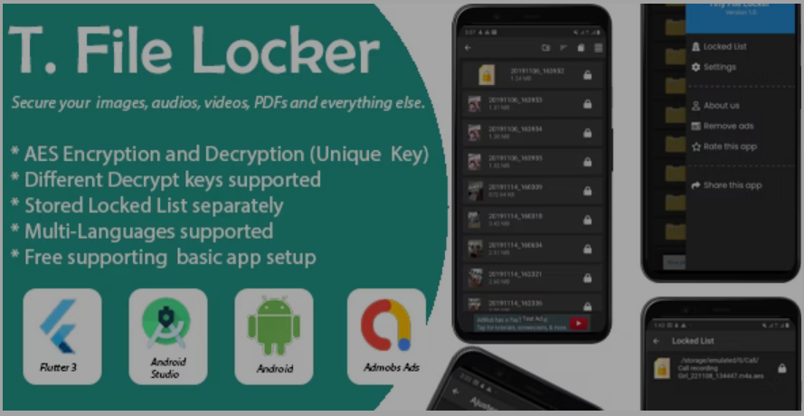
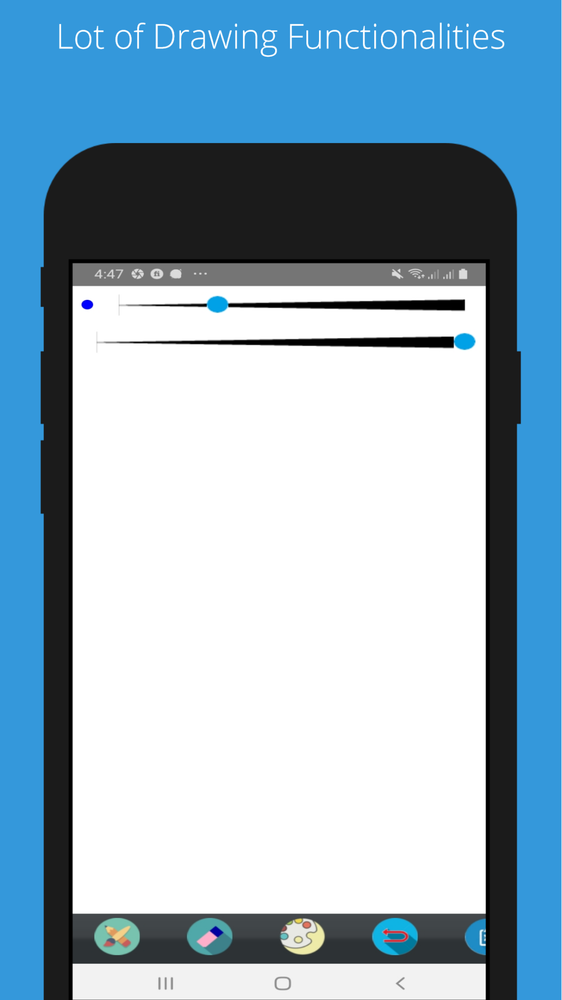

# 🧪 Projects

## [Fawry App](https://play.google.com/store/apps/details?id=cash.fawry&hl=en_CA&gl=US) 🔗
- Role: Fullstack Developer

- Responsibilities:
> - Design and implement the app's user interface and user experience.
> - Update the app according to user’s requirement.
> - Connect Backend APIs.
> - Test and debug the app to ensure optimal performance.
> - Continuously update and maintain the app to ensure the best user experience.
> - Present the currently developed modules to clients and supervisors.
 

    
    
    

## Ecommerce and Delivery App
-  An Unique Delivery Tracking and E-commerce System

 > - Research existing application techniques and technologies.
 > - Design and implement the app's user interface and user experience.
 > - Develop Backend APIs and deploy to Azure.
 > - Implement features such as virtual try-on and real-time tracking.
 > - Test and debug the app to ensure optimal performance.
 > - Continuously update and maintain the app to ensure the best user experience.
 > - Present the currently developed modules to clients and supervisors.
 > - Documentations.

 

    
    
    

## [Video Scheduling App](https://github.com/praneethpj/Flutter_Video_Consultant_App_FrontEnd) 🔗
> - Research UI and UX.
> - Research existing application techniques and technologies.
> - Develop User interfaces and functions including user authentication, appointment scheduling, and video calls, professionals' availability, with call reminders for both users and professionals,professional profile search and the ability to transition a user profile into a professional profile. 
> - Develop Backend APIs have been developed using Node.js.  
> - Test and debug the app to ensure optimal performance.

[Watch demo](https://www.youtube.com/watch?v=QFEUU23SFdE)

## [Android File Locker](https://codecanyon.net/item/tiny-file-locker-flutter/41998304) 🔗
- To lock users' files with multiple passcodes  

> - Research on Flutter concurrent execute tasks.
> - Study on  isolate and compute
> - Developed an app that support locked and unlocked there file with a preset password.
> - Create Documentation.
> - Released the App on Codecanyon.
> - Released the App on Google Play Store.
> - Test and debug the app to ensure optimal performance.
> - Provide Customer Support.
 
[watch demo](https://previews.customer.envatousercontent.com/h264-video-previews/fb9d95fa-15b7-4284-90dc-8faf37aa3811/41998304.mp4)

 

    
 

 

## [Savenndra Web site](http://savenndra.com/) 🔗
> - Research existing restaurant websites UI/UX.
> - Design the website.
> - Present the currently developed modules to clients.

 

    
    

## Azvehicle
- A Web scrap project to gain vehicle  informations 

> - Research existing web scraping techniques.
> - Developed python algorithms 
> - Developed PHP web project
> - Released the project

 

    

## [Android paint app project](https://play.google.com/store/apps/details?id=basic.praneethpj.app) 🔗
> - Research existing paint techniques,apps and features.
> - Develop a android paint app.
> - Provide customer support.
> - Release to play store.
> - Fix bugs and releases

 

    
    

[Github] (https://github.com/praneethpj/Android-Paint-App/)

## [Android paint app project](https://play.google.com/store/apps/details?id=com.praneeth.pj.pranksound) 🔗
- An application for playing funny sounds 

> - Research existing paint techniques,apps and features.
> - Develop android app

 

    
    

## iModules
> - Modify existing settlement modules according to the customer
Requirements.
> - Modify the modules according to Visa and mastercard mandates.
> - Provide customer support for new module implementation and documentation, as
well as review customer issue tickets and provide solutions.

[Documentation](https://drive.google.com/file/u/6/d/1VVyxNGRTokU7hu1fRY8BAQJDJedXniY6/view?pli=1)

 

    
    

## Apigateway
- Business to Business application for api management
> - Bug fixing.
> - Customer support.
> - Migrate Carbon XML modules to Spring boot.
> - Testing

 

    

## ENode web app
- Develop a B2B Stream Education platform for remote learners.
> - Develop Frontend
> - Develop a B2B Stream Education platform for remote learners. 
> - Develop a Spring Boot microservice for notifications, utilizing AWS SNS and SQS. 
> - Create an AWS Lambda function to support MailChimp using Python.
> - Test modules using JUnit

 

    
     

 
 